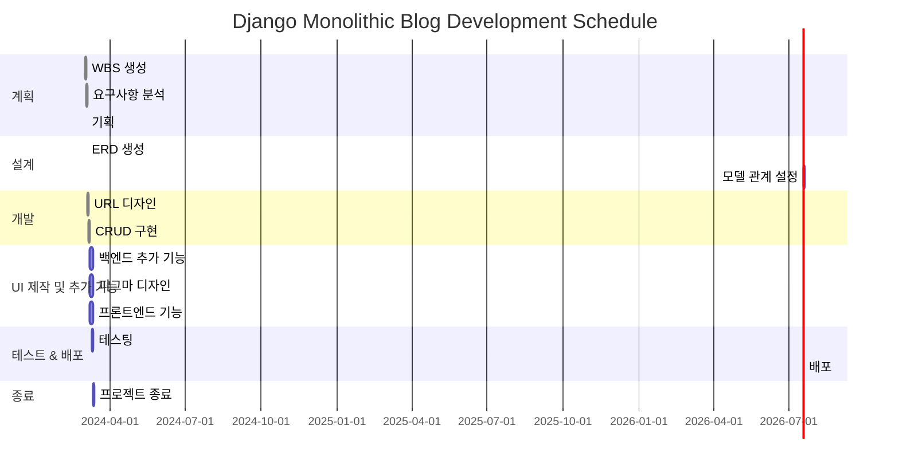

# Monologs

## 프로젝트 개요(제작 중)

http://43.200.237.70:8000/

- Django Monolithic Blog Project
`monologs`는 사용자가 블로그 포스트를 작성하고, 로그인 및 회원가입 기능을 통해 사용자 인증을 관리하는 동시에, 게시글을 올릴 수 있는 게시판을 제공하는 웹 애플리케이션입니다.

## 편의 기능(제작 중)
- **블로그 포스트 작성**: 사용자는 풍부한 텍스트 편집 기능을 제공하는 quill 에디터를 사용하여 블로그 포스트를 작성할 수 있습니다. 이 오픈소스 리치 텍스트 에디터는 기본적으로 이미지업로드와 동영상 임베딩 기능을 제공합니다.
- **회원가입 및 로그인**: 회원으로 가입하면 게시글과 댓글을 쓸 수 있습니다.
- **게시판 기능**: 사용자는 자신의 블로그 포스트를 게시하고 다른 사용자의 포스트를 볼 수 있습니다.
- **팔로우 기능**: 사용자는 다른 사용자를 팔로우 할 수 있습니다.
- **공유 기능**: 사용자는 자신의 퍼블릭 프로필 페이지를 공유할 수 있습니다. 
- **AI 글 작성**: AI 글 초안 작성 기능! 커스텀.
- **북마크**: 글이나 댓글을 북마크하여 사용자의 프라이빗 프로필 페이지에서 볼 수 있습니다.
- **like**: 글이나 댓글에 LIKE를 답니다. 자신의 컨텐츠는 LIKE 할 수 없습니다.
- **카테고리 편집**: 퍼블릭 프로필 페이지에서, 좀더 블로그 같이 카테고리를 편집할 수 있습니다.
- **태그 필터 기능**: 좋아하는 태그만 모아보는 검색 페이지.
- **검색 기능**: 검색 기능
- 

## 최적화 기능
- **사이트 내 이미지 Wepb converter**: admin 페이지에 이미지 컨버터가 있습니다
- **업로드 되는 이미지 자동 Webp 변환 및 이름 변경**: 보안하고 성능을 위해서.
- **quill editor 내에서 이미지 압축**: Webp이 될수 있는건 한정된 확장자이기 때문에 quill 에디터에 다양한 확장자를 지원하게 하고 대신 이미지를 압축해서 올립니다.
- **template 내 component 분리**: include 폴더를 만들어서 재사용 할 수 있는 컴포넌트 단위로 분리하고 가독성
- **custom commands**: django monolic 프로젝트를 위하여 커스텀 커맨드 제작, bash
- **brouser hot reload**: 개발 편의성으로 django-tailwind를 npm으로 깔아서 tailwind plugin을 사용할 수 있게 하고 커스텀 유틸리티 설정을 실시간으로 빌드함. 클라이언트단 제작을 위해 새로고침하지 않아도 됨
- **Docker compose**: 도커 이미지를 생성하고 도커허브에 올림. tailwind와 django-app을 combine해서 1개의 컨테이너로 서브함
- **AWS lightsail로 배포**: DockerHub와 AWS lightsail을 연동해서 배포함. 다만, nginx를 깔지 않아서 https가 아닌 http. 

- 

## ERD


- Post_Tags 중간 테이블을 통해 CustomUser 및 Tag 에 대한 관게 설정(m:n)
- GenericForeignKey를 사용해서 post와 comment에 like와 bookmark를 추가하고 그걸 mixin으로 재사용
- comment 삭제를 -> 인스턴스 삭제 대신 컨텐츠 오버라이드하고 클라이언트 단에서 처리
- CustomUser 모델의 profile_picture를 crop image랑 연동하고 OneToOneField로 1개만 가지게 설정
- 카테고리는 CustomUser 와 다대일 관계로 연결 (한 명의 사용자가 여러 카테고리를 생성할 수 있음).
Post는 이제 다대일(많은 게시물이 하나의 카테고리에 속할 수 있음) 로 Category 와 연결


```mermaid
Table CustomUser {
  id int [pk, increment]
  username varchar
  email varchar
  profile_status varchar(200) [null]
  profile_message text [null]
  profile_picture_id int [null, ref: > CroppedImage.id]
}

Table CroppedImage {
  id int [pk, increment]
  original_file varchar 
  file varchar 
 user_id int [null, ref: > CustomUser.id] 
  uploaded datetime
  
}

Table Category {
  id int [pk, increment]
  name varchar(100)
  author_id int [ref: > CustomUser.id]
  parent_id int [null, ref: > Category.id] 
}

Table Tag {
  id int [pk, increment]
  name varchar(100) [unique]
}

Table Post {
  id int [pk, increment]
  title varchar(100)
  summary varchar(200) [null] 
  author_id int [ref: > CustomUser.id]
  content text
  thumbnail varchar [null] 
  created_at datetime
  updated_at datetime
  category_id int [null, ref: > Category.id] 
}

Table Comment {
  id int [pk, increment]
  content text
  author_id int [ref: > CustomUser.id]
  created_at datetime
  updated_at datetime
  post_id int [ref: > Post.id]
  parent_id int [null, ref: > Comment.id]
  is_deleted bool [default: false] 
}

Table Like {
  id int [pk, increment]
  user_id int [ref: > CustomUser.id]
  content_type_id int
  object_id int
  
}

Table Bookmark {
  id int [pk, increment]
  user_id int [ref: > CustomUser.id]
  content_type_id int
  object_id int
  // Unique together: user_id, content_type_id, object_id
}

Table Follow {
  id int [pk, increment]
  follower_id int [ref: > CustomUser.id]
  following_id int [ref: > CustomUser.id]
 
}

Table Post_Tags {
  post_id int [ref: > Post.id]
  tag_id int [ref: > Tag.id]
 
}

Ref: "CroppedImage"."user_id" - "CustomUser"."profile_picture_id" 


```

# 배포 방법
```
http://43.200.237.70:8000/

# AWS lightsail 인스턴스에 docker, docker compose 설치
# SSH로 인스턴스의 루트 경로에 docker-compose.yml 전송
# docker image를 만들어서 dockerHub에 push 한 후에 인스턴스에서
docker-compose up -d

# 로컬에서 도커 빌드 시
docker-compose up -d 
docker build -t 유저이름/django-app:web-latest .

docker push 유저이름/django-app:web-latest

```
## WBS



## figma

- 와이어프레임(제작 중)
[피그마](https://www.figma.com/files/project/212207199/monologs?fuid=1012359410667987596)

- 디자인

## 설치 방법
프로젝트를 설치하고 실행하기 위한 단계별 지침은 다음과 같습니다.

1. **프로젝트 클론**:
    ```
    git clone
    cd monologs
    ```

2. **가상 환경 생성 및 활성화**:
    ```
    python -m venv venv
    # custom commands는 7번으로

    source venv/bin/activate

    ```

3. **필요한 패키지 설치**:
    ```
    pip install -r requirements.txt
    ```

4. **환경 변수 설정**:
    `.env` 파일을 프로젝트 루트 디렉토리에 생성하고, 아래와 같이 `SECRET_KEY`를 설정합니다.
    ```
    SECRET_KEY: "여기에_당신의_시크릿_키를_입력하세요"
    DEBUG=True
    ```

5. **가상환경 실행**:
    ```
    # git bash
    source ./venv/Scripts/activate
    ```

    ```
    # powerShall
    ./venv/Scripts/activate
    ```

6. **기본 커맨드(PowerShell)**:
    ```
   python manage.py runserver
    ```
    **다른 터미널에서 동시 실행**
    ```
    python manage.py tailwind start
    ```


7. **custom commands(Git Bash)**:
    ```
    ./commands.sh
    reinstall

    ./commands.sh
    add_admin(admin 유저 생성)

    # 설치 후 가상환경이 deactivate 됩니다.
    # ./ 세션 내 실행
    # . `공백` 인스턴스 내 실행
    ./commands.sh
    run
    ```

## 사용된 기술
- Django 
- Pillow
- Django-quill-editor
- Django-image-cropping
- Django-tailwind
- Django_browser_reload
- Django-ajax_select
- Tom Select
- daisyUI
- django-webp
- python-dotenv
- google-auth 
- google-auth-oauthlib 
- requests 
- google-analytics-data
- django-tree-queries


## 폴더 트리
```
트리
```


## 개발 환경 설정
개발을 시작하기 전에, 다음 도구들이 시스템에 설치되어 있어야 합니다:
- Python (3.8 이상)
- Node.js (18.18 이상)
- pip
- Git

## 트러블 슈팅

### 1. django-quill-editor custom
ai 서비스를 위해, 전역 객체에 접근. 한국
패키지를 뜯기는 그러니까
docker compose

### 2. django-tailwind docker image 설성
1에서 뜯은 docker compose로 tailwind도 말려듦


### 3. AWS Lightsail instance
배포를 위해 컨테이너 설정
docker compose 오케스트레이션

instance로 전환

### 4. Docker login


### 5. mix-in Circular import
앱 전체의 다양한 콘텐츠 유형 간의 상호 참조가 필요한 Like, Bookmark를 코드의 모듈성과 재사용성을 강화하기 위해 우리는 믹스인 기반 접근 방식을 채택했습니다,
그래서 모든 콘텐츠에 대한 좋아요 및 북마크 상태를 확인하기 위한 로직을 만들고 이걸 content type이랑 object id를 가지고 어디에서나 쓸수 있게 LikeMixin. BookmarkMixin 이라는 이름으로 캡슐화했습니다.
그런데 이걸 실제 모델 내에서 쓰려니 Circular import 순환참조 문제가 발생하였습니다.

그래서 채택한 방법, 믹스인에서 Django의 ContentType 라이브러리가 가지고 있는 apps.get_model 동적 모델 검색을 사용해서 모델 클래스가 런타임에 모델을 직접 가져오게 해서 순환 종속성을 방지했습니다.


