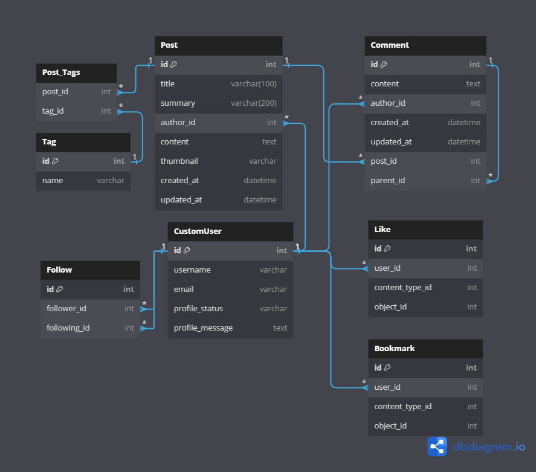

# Monologs

## 프로젝트 개요(제작 중)

- Django Monolithic Blog Project
`monologs`는 사용자가 블로그 포스트를 작성하고, 로그인 및 회원가입 기능을 통해 사용자 인증을 관리하는 동시에, 게시글을 올릴 수 있는 게시판을 제공하는 웹 애플리케이션입니다.

## 기능(제작 중)
- **블로그 포스트 작성**: 사용자는 풍부한 텍스트 편집 기능을 제공하는 quill 에디터를 사용하여 블로그 포스트를 작성할 수 있습니다. 이 오픈소스 리치 텍스트 에디터는 기본적으로 이미지업로드와 동영상 임베딩 기능을 제공합니다.
- **회원가입 및 로그인**: 회원으로 가입하면 게시글과 댓글을 쓸 수 있습니다.
- **게시판 기능**: 사용자는 자신의 블로그 포스트를 게시하고 다른 사용자의 포스트를 볼 수 있습니다.
- **팔로우 기능**: 사용자는 다른 사용자를 팔로우 할 수 있습니다.
- **공유 기능**: 
- **AI 글 작성**:
- **북마크**:
- **like**:
- ****:


## ERD


- tags 중계 테이블
- GenericForeignKey를 사용해서 post와 comment에 like와 bookmark 추가(클래스 상속으로 변경?)


## WBS


## figma

- 와이어프레임(제작 중)
[피그마](https://www.figma.com/files/project/212207199/monologs?fuid=1012359410667987596)

- 디자인

## 설치 방법
프로젝트를 설치하고 실행하기 위한 단계별 지침은 다음과 같습니다.

1. **프로젝트 클론**:
    ```
    git clone
    cd monologs
    ```

2. **가상 환경 생성 및 활성화**:
    ```
    python -m venv venv
    # custom commands는 7번으로

    source venv/bin/activate

    ```

3. **필요한 패키지 설치**:
    ```
    pip install -r requirements.txt
    ```

4. **환경 변수 설정**:
    `secrets.json` 파일을 프로젝트 루트 디렉토리에 생성하고, 아래와 같이 `SECRET_KEY`를 설정합니다.
    ```json
    {
        "SECRET_KEY": "여기에_당신의_시크릿_키를_입력하세요"
    }
    ```

5. **가상환경 실행**:
    ```
    # git bash
    source ./venv/Scripts/activate
    ```

    ```
    # powerShall
    ./venv/Scripts/activate
    ```

6. **기본 커맨드(PowerShell)**:
    ```
   python manage.py runserver
    ```
    **다른 터미널에서 동시 실행**
    ```
    python manage.py tailwind start
    ```


7. **custom commands(Git Bash)**:
    ```
    ./commands.sh
    reinstall

    # 설치 후 가상환경이 deactivate 됩니다.
    ./commands.sh
    run
    ```

## 사용된 기술
- Django 
- Pillow
- Django-quill-editor
- Django-image-cropping
- Django-tailwind
- Django_browser_reload
- Django-ajax_select
- Tom Select
- daisyUI
- django-webp
- python-dotenv
- google-auth 
- google-auth-oauthlib 
- requests 
- google-analytics-data


## 개발 환경 설정
개발을 시작하기 전에, 다음 도구들이 시스템에 설치되어 있어야 합니다:
- Python (3.8 이상)
- pip
- Git

