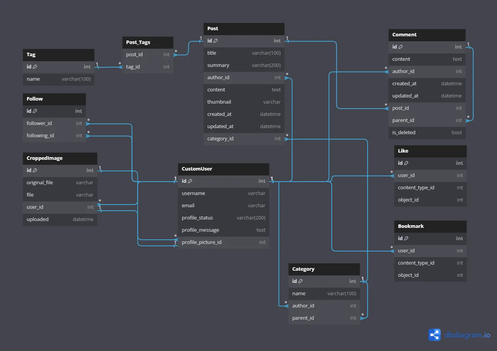
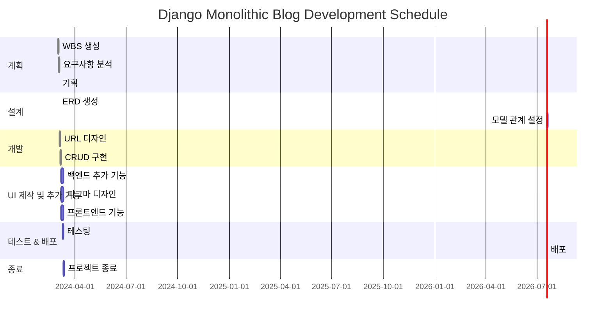

# Monologs

## 프로젝트 개요

배포 주소 : http://43.200.237.70:8000/


- Django Monolithic Blog Project
  `monologs`는 사용자가 블로그 포스트를 작성하고, 로그인 및 회원가입 기능을 통해 사용자 인증을 관리하는 동시에, 게시글을 올릴 수 있는 게시판을 제공하는 웹 애플리케이션입니다. AI가 초안 작성을 도와주니다.

# 목차

- [프로젝트 개요](#프로젝트-개요)
- [편의 기능](#편의-기능)
- [효율성 향상 및 최적화](#효율성-향상-및-최적화)
- [엔티티 관계 다이어그램(ERD)](#엔티티-관계-다이어그램erd)
- [폴더 트리](#폴더-트리)
- [배포 방법](#배포-방법개발용)
- [WBS](#wbs)
- [figma](#figma)
- [설치 방법](#설치-방법)
- [사용된 기술](#사용된-기술)
- [테스트 주소](#테스트-주소)
- [명세](#명세)
- [개발환경 설정](#개발-환경-설정)
- [트러블슈팅](#트러블-슈팅)

## 편의 기능

- **블로그 포스트 작성**
  블로그 포스트 작성은 편리한 quill 에디터를 통해 이루어집니다. quill은 이미지 업로드와 동영상을 쉽게 임베드할 수 있는 리치 텍스트 에디터로, 사용자 친화적인 인터페이스를 제공하여 누구나 쉽게 글을 작성할 수 있게 합니다. 풍부한 텍스트 편집 기능을 제공하여 복잡한 포맷의 포스트도 손쉽게 작성할 수 있습니다.

- **회원가입 및 로그인**
  사용자는 간단한 회원가입 및 로그인 절차를 통해 플랫폼에 액세스할 수 있습니다. 회원가입을 완료하면, 사용자는 개인화된 경험을 즐길 수 있으며 게시글 및 댓글 작성 등의 기능을 이용할 수 있습니다. 안전하고 편리한 인증 과정을 통해 사용자 정보를 보호합니다.

- **프로필 이미지 기능**
  사용자는 이미지를 크롭하여 프로필로 사용할 수 있습니다. 프로필이 없으면 기본 프로필 이미지가 주어집니다.

- **게시판 기능**
  사용자는 자신이 작성한 블로그 포스트를 게시할 수 있으며, 다른 사용자의 포스트도 열람할 수 있습니다. 이 게시판은 사용자 간의 상호작용을 촉진하고, 다양한 주제와 아이디어를 공유하는 공간으로 기능합니다. 사용자는 흥미로운 내용을 쉽게 찾아볼 수 있습니다.

- **팔로우 기능**
  관심 있는 다른 사용자를 팔로우할 수 있는 기능을 제공합니다. 이를 통해 사용자는 팔로우한 다른 사용자의 최신 포스트를 쉽게 확인할 수 있으며, 개인적인 네트워크를 확장할 수 있습니다. 팔로우 시스템은 사용자 간의 커뮤니티 형성에 기여합니다.

- **공유 기능**
  사용자는 자신의 메타태그가 포함된 퍼블릭 프로필 페이지를 손쉽게 공유할 수 있습니다. 이를 통해 더 많은 사람들과 자신의 포스트를 공유하고, 개인 브랜딩을 강화할 수 있습니다.
- **AI 글 작성**
  AI 기반의 글 초안 작성 기능을 제공하여 사용자가 보다 쉽게 포스트를 시작할 수 있게 돕습니다. 이 기능은 사용자의 작성 스타일을 학습하여, 개인화된 글쓰기 도움을 제공합니다. 커스텀 설정을 통해 다양한 글쓰기 요구에 맞춤화된 도움을 받을 수 있습니다.

- **북마크**
  사용자는 관심 있는 글이나 댓글을 북마크하여, 나중에 쉽게 찾아볼 수 있습니다. 이 기능은 사용자가 정보를 효율적으로 관리하고, 중요한 내용을 빠르게 접근할 수 있도록 합니다. 사용자의 프라이빗 프로필 페이지에서 북마크한 내용을 확인할 수 있습니다.

- **Like**
  사용자는 글이나 댓글에 '좋아요'를 표시할 수 있습니다. 이는 긍정적인 피드백을 제공하고, 커뮤니티 내에서 상호작용을 촉진합니다. 자신의 컨텐츠에는 '좋아요'를 할 수 없으며, 이는 공정한 상호작용을 유도합니다.

- **카테고리 편집**
  사용자는 퍼블릭 프로필 페이지에서 자신의 블로그를 더욱 전문적으로 보이게 하기 위해 카테고리를 편집할 수 있습니다. 이를 통해 방문자들이 관심 있는 내용을 더 쉽게 찾을 수 있도록 돕습니다. 사용자는 자신의 포스트를 주제별로 구분하여 표시할 수 있습니다.

- **태그 필터 기능**
  사용자는 자신이 선호하는 태그에 따라 포스트를 필터링할 수 있는 검색 페이지를 이용할 수 있습니다. 이 기능을 통해 관심 있는 주제의 글만을 모아볼 수 있으며, 사용자의 취향과 관심사에 맞춘 콘텐츠를 쉽게 발견할 수 있습니다.

## 효율성 향상 및 최적화

- **사이트 내 이미지 WebP 변환기**
  관리자 페이지에는 이미지를 WebP 형식으로 자동 변환하는 컨버터가 탑재되어 있습니다. 이는 웹 성능 최적화의 핵심 요소로, 페이지 로딩 시간을 단축시키고 사용자 경험을 개선합니다.

- **업로드 되는 이미지 자동 WebP 변환 및 이름 변경**
  보안과 성능을 동시에 고려하여, 업로드되는 이미지들(썸네일, 프로필 사진)은 자동으로 WebP 형식으로 변환되며, 파일명도 변경됩니다. 이 과정은 서버 자원의 효율적 사용과 빠른 콘텐츠 전송을 목적으로 합니다.

- **Quill 에디터 내에서의 이미지 압축**
  Webp을 별도의 설정 없이 일괄변환하면 동적인 이미지를 얻을 수 없기 때문에, Quill 에디터 내에 업로드되는 이미지는 Webp 변환을 하지 않고, 다양한 확장자의 이미지를 지원하게 두었습니다. 다만, 이미지 용량을 제한하고 quill-image-compress로 압축을 합니다.

- **템플릿 내 컴포넌트 분리**
  재사용 가능한 컴포넌트 단위로 코드를 분리하여 `include` 폴더에 저장합니다. 코드의 가독성을 높이고, 개발자가 유지보수를 보다 쉽게 할 수 있도록 했습니다.

- **커스텀 명령어**
  Django 모놀로그 프로젝트에 최적화된 커스텀 명령어를 제공하여, 커맨드 입력과정을 자동화하고 효율을 증가시킵니다. 특히나 tailwind를 따로 같이 켜야 되는 프로젝트에서 터미널 2개 켜는 시간을 다 줄이면 3시간은 나올거 같습니다. 이러한 커스텀 명령어는 Bash 스크립트를 통해 실행되며, 반복 작업을 간소화합니다.

- **브라우저 핫 리로드**
  cdn이 아닌, Django-Tailwind와 npm을 사용하여 프로젝트 내에서 Tailwind CSS의 플러그인들을 활용할 수 있게 했습니다. 개발 중인 클라이언트 사이드 코드에 대해 페이지를 새로 고침하지 않고도 실시간으로 변경 사항을 반영할 수 있는 환경을 제공합니다. 역시 새로고침 하는 시간을 줄여서 기능을 더 만들 수 있게 합니다.

- **Docker Compose를 이용한 컨테이너 오케스트레이션**
  Docker Compose를 활용한 컨테이너화는 복수의 서비스가 결합된 애플리케이션을 효율적으로 관리하고 배포할 수 있는 강력한 방법입니다. 본 프로젝트에서는 Django 애플리케이션과 Tailwind CSS를 포함하는 독립적인 환경을 단일 컨테이너 내에서 구성하고 관리합니다. 이러한 컨테이너화는 배포 과정을 대폭 간소화하며, DockerHub를 통한 공유는 프로젝트의 재사용성과 확장성을 높입니다.

- **AWS Lightsail을 통한 배포**
  DockerHub와 AWS Lightsail을 연동하여 애플리케이션을 배포했니다. 이 방법은 효율적이며 비용 효과적인 서버 관리를 가능하게 합니다. 아직은 무료이니까요. 단, 정보수집의 부족으로 nginx가 설정되어 있지 않기에 현재 HTTPS가 아닌 HTTP를 사용하고 있어 보안상 위험이 있습니다. 테스트 배포는 내일 중지 됩니다.

## 엔티티 관계 다이어그램(ERD)



- **Post_Tags 중계 테이블**을 사용하여 `CustomUser`와 `Tag` 사이의 다대다(m:n) 관계를 설정합니다. 이 구조는 한 게시물이 여러 태그를 가질 수 있으며, 한 태그가 여러 게시물에 할당될 수 있음을 나타냅니다.
-
- **GenericForeignKey**를 활용하여 `Post`와 `Comment`에 `Like`와 `Bookmark` 기능을 추가합니다. 이 기능들은 재사용 가능하게 구현되어, 코드의 재사용성과 확장성을 높이며 다형성을 활용한 관계 설정을 가능하게 합니다.

- `Comment`의 삭제는 실제 인스턴스를 삭제하는 대신 내용을 오버라이드하고, 이를 클라이언트 측에서 처리하여 사용자에게 삭제된 것처럼 보이게 합니다. 이 방법은 데이터의 무결성을 유지하며, 필요시 복구할 수 있는 가능성을 열어둡니다.

- **CustomUser 모델의 profile_picture**는 이미지 크롭 기능과 연동되어 있으며, `OneToOneField`를 사용하여 사용자당 하나의 프로필 사진만을 가지도록 설정합니다. 이 관계는 데이터베이스 설계에서 1:1 관계를 나타내며, 사용자 프로필과 밀접하게 연결된 데이터의 일관성을 보장합니다.

- `Category`는 `CustomUser`와 다대일(N:1) 관계로 설정되어 있어, 한 명의 사용자가 여러 카테고리를 생성할 수 있습니다. 반면, `Post`는 `Category`와 다대일(N:1) 관계에 있어, 여러 게시물이 하나의 카테고리에 속할 수 있음을 나타냅니다. 이러한 구조는 웹 애플리케이션에서 컨텐츠의 분류 및 조직화를 용이하게 합니다.

- `Like`와 `Bookmark`모델은 ERD에서 그 관게가 잘 나타나지 않는데, 어떤 모델의 인스턴스에도 '좋아요'나 '북마크'를 할 수 있는 범용성과 다형성을 지원하기 위해 이렇게 만들었습니다. 여러 모델에 걸쳐 재사용 가능해야 하기 때문에 Django의 `ContentType` 프레임워크를 사용하여, `mixin`으로 사용합니다.

## 폴더 트리

```
📦accounts
 ┣ 📜admin.py
 ┣ 📜apps.py
 ┣ 📜context_processors.py
 ┣ 📜forms.py
 ┣ 📜mixins.py
 ┣ 📜models.py
 ┣ 📜tests.py
 ┣ 📜urls.py
 ┣ 📜views.py
 ┗ 📜__init__.py
 📦blog
 ┣ 📜admin.py
 ┣ 📜apps.py
 ┣ 📜forms.py
 ┣ 📜lookups.py
 ┣ 📜mixins.py
 ┣ 📜models.py
 ┣ 📜signals.py
 ┣ 📜tests.py
 ┣ 📜urls.py
 ┣ 📜views.py
 ┗ 📜__init__.py
 📦config
 ┣ 📜asgi.py
 ┣ 📜settings.py
 ┣ 📜test_settings.py
 ┣ 📜urls.py
 ┣ 📜wsgi.py
 ┗ 📜__init__.py
 📦main
 ┣ 📜admin.py
 ┣ 📜apps.py
 ┣ 📜mixins.py
 ┣ 📜models.py
 ┣ 📜tests.py
 ┣ 📜urls.py
 ┣ 📜utils.py
 ┣ 📜views.py
 ┗ 📜__init__.py
 📦static
 ┣ 📂css
 ┃ ┣ 📜style-exgamples.css
 ┃ ┗ 📜styles.css
 ┣ 📂custom_django_quill
 ┃ ┣ 📜django_quill.js
 ┃ ┗ 📜widget.html
 ┣ 📂images
 ┃ ┣ 📂banners
 ┃ ┃ ┣ 📜background.webp
 ┃ ┃ ┣ 📜darkmode-background.webp
 ┃ ┃ ┣ 📜erd-final.webp
 ┃ ┃ ┗ 📜profile-header.webp
 ┃ ┣ 📂logos
 ┃ ┃ ┣ 📜bird-logo.webp
 ┃ ┃ ┣ 📜dark-logo.webp
 ┃ ┃ ┣ 📜favicon.ico
 ┃ ┃ ┣ 📜hr-logo.webp
 ┃ ┃ ┗ 📜picture-default.webp
 ┃ ┗ 📂readme
 ┃ ┃ ┗ 📜erd-final-final.webp
 ┗ 📂js
 ┃ ┣ 📜crop.js
 ┃ ┣ 📜easyQuill.js
 ┃ ┣ 📜prompt.js
 ┃ ┗ 📜utils.js
📦templates
 ┣ 📂accounts
 ┃ ┣ 📂include
 ┃ ┃ ┣ 📜crop.html
 ┃ ┃ ┣ 📜following_list.html
 ┃ ┃ ┗ 📜user_following_list.html
 ┃ ┣ 📜category_create.html
 ┃ ┣ 📜login.html
 ┃ ┣ 📜private_profile.html
 ┃ ┣ 📜public-profile-category.html
 ┃ ┣ 📜public_profile.html
 ┃ ┣ 📜register.html
 ┃ ┗ 📜user_confirm_delete.html
 ┣ 📂blog
 ┃ ┣ 📂include
 ┃ ┃ ┣ 📜comment_confirm_delete.html
 ┃ ┃ ┣ 📜comment_form.html
 ┃ ┃ ┣ 📜comment_list.html
 ┃ ┃ ┣ 📜comment_update_form.html
 ┃ ┃ ┣ 📜post_confirm_delete.html
 ┃ ┃ ┣ 📜reply_form.html
 ┃ ┃ ┣ 📜reply_update_form.html
 ┃ ┃ ┗ 📜search_form.html
 ┃ ┣ 📜blog_detail.html
 ┃ ┣ 📜blog_list.html
 ┃ ┣ 📜post_create.html
 ┃ ┣ 📜post_update.html
 ┃ ┗ 📜search_results.html
 ┣ 📂main
 ┃ ┣ 📜about.html
 ┃ ┗ 📜index.html
 ┣ 📜base.html
 ┗ 📜custom_404.html
 📦theme
 ┣ 📂static
 ┃ ┣ 📂css
 ┃ ┃ ┗ 📂dist
 ┃ ┃ ┃ ┗ 📜styles.css
 ┃ ┗ 📂fonts
 ┃ ┃ ┣ 📜HappinessSansVF.ttf
 ┃ ┃ ┣ 📜nanum-hippie.ttf
 ┃ ┃ ┣ 📜nanum-white-tail.ttf
 ┃ ┃ ┗ 📜NanumSquareNeo-Variable.ttf
 ┣ 📂static_src
 ┃ ┣ 📂node_modules
 ┃ ┃ ┣ 📂.bin
 ┃ ┃ ┃ ┣ 📜bin.mjs
 ┃ ┃ ┃ ┣ 📜LICENSE
 ┃ ┃ ┃ ┣ 📜package.json
 ┃ ┃ ┃ ┣ 📜README.md
 ┃ ┃ ┃ ┗ 📜util.js
 ┃ ┃ ┗ 📜.package-lock.json
 ┃ ┣ 📂src
 ┃ ┃ ┗ 📜styles.css
 ┃ ┣ 📜.gitignore
 ┃ ┣ 📜package-lock.json
 ┃ ┣ 📜package.json
 ┃ ┣ 📜postcss.config.js
 ┃ ┗ 📜tailwind.config.js
 ┣ 📂templates
 ┃ ┗ 📜base.html
 ┣ 📜apps.py
 ┗ 📜__init__.py
┣ 📜.gitignore
┣ 📜commands.sh
┣ 📜db.sqlite3
┣ 📜manage.py
┣ 📜README.md
┣ 📜requirements.txt
```

# 배포 방법(개발용)

```
http://43.200.237.70:8000/

# AWS lightsail 인스턴스에 docker, docker compose 설치
# SSH로 인스턴스의 루트 경로에 docker-compose.yml 전송
# 로컬에서 docker image를 만들어서 dockerHub에 push 한 후에

docker pull 유저이름/django-app:web-latest
docker-compose up -d

# 로컬에서 도커 빌드 시
docker-compose up -d
docker build -t 유저이름/django-app:web-latest .

docker push 유저이름/django-app:web-latest

```

## WBS



## figma

- 와이어프레임
  [피그마](https://www.figma.com/files/project/212207199/monologs?fuid=1012359410667987596)

## 설치 방법

프로젝트를 설치하고 실행하기 위한 단계별 지침은 다음과 같습니다.

1. **프로젝트 클론**:

   ```
   git clone
   cd monologs
   ```

2. **가상 환경 생성 및 활성화**:

   ```
   python -m venv venv
   # custom commands는 7번으로

   source venv/bin/activate

   ```

3. **필요한 패키지 설치**:

   ```
   pip install -r requirements.txt
   ```

4. **환경 변수 설정**:
   `.env` 파일을 프로젝트 루트 디렉토리에 생성하고, 아래와 같이 `SECRET_KEY`를 설정합니다.

   ```
   SECRET_KEY: "여기에_당신의_시크릿_키를_입력하세요"
   DEBUG=True
   ```

5. **가상환경 실행**:

   ```
   # git bash
   source ./venv/Scripts/activate
   ```

   ```
   # powerShall
   ./venv/Scripts/activate
   ```

6. **기본 커맨드(PowerShell)**:

   ```
   python manage.py runserver
   ```

   **다른 터미널에서 동시 실행**

   ```
   python manage.py tailwind start
   ```

7. **custom commands(Git Bash)**:

   ```
   ./commands.sh
   reinstall

   ./commands.sh
   add_admin(admin 유저 생성)

   # 설치 후 가상환경이 deactivate 됩니다.
   # ./ 세션 내 실행
   # . `공백` 인스턴스 내 실행
   ./commands.sh
   run
   ```

## 사용된 기술

- Django
- Pillow
- Django-quill-editor
- Django-image-cropping
- Django-tailwind
- Django_browser_reload
- Django-ajax_select
- Tom Select
- daisyUI
- google-auth
- google-auth-oauthlib
- requests
- google-analytics-data
- django-tree-queries
- jsTree
- django-environ

## 테스트 주소

```
http://43.200.237.70:8000/

http://43.200.237.70:8000/blog/ 블로그 리스트
http://43.200.237.70:8000/blog/1/ 블로그 디테일

http://43.200.237.70:8000/blog/search/?tag=Cookie  태그검색
http://43.200.237.70:8000/blog/search/?q=%EC%BB%A8%ED%85%90%EC%B8%A0  단어검색


http://43.200.237.70:8000/accounts/register/ 회원가입
http://43.200.237.70:8000/accounts/login/  로그인

로그인 필요
http://43.200.237.70:8000/blog/create/  글쓰기
http://43.200.237.70:8000/accounts/profile/ 프라이빗 프로필
http://43.200.237.70:8000/accounts/category/create/ 카테고리 생성
http://43.200.237.70:8000/@[username]/  퍼블릭 프로필(블로그)


```

## 명세

| App      | URL Pattern                    | View                       | Description                     |
| -------- | ------------------------------ | -------------------------- | ------------------------------- |
| config   | admin/                         | admin.site.urls            | Django 관리자 인터페이스        |
| config   | ""                             | main.urls                  | 메인 앱의 URL 패턴              |
| config   | blog/                          | blog.urls                  | 블로그 앱의 URL 패턴            |
| config   | accounts/                      | accounts.urls              | 계정 앱의 URL 패턴              |
| config   | **reload**/                    | django_browser_reload.urls | Django 브라우저 리로드 URL 패턴 |
| config   | ajax_select/                   | ajax_select.urls           | Ajax 선택 URL 패턴              |
| main     | ""                             | IndexView                  | 메인 인덱스 페이지              |
| main     | about/                         | AboutView                  | 정보 페이지                     |
| main     | download_image/<int:pk>/       | ConvertAndDownloadView     | 이미지 변환 및 다운로드         |
| main     | @<str:username>/               | PublicProfileView          | 공개 프로필 페이지              |
| blog     | ""                             | PostListView               | 블로그 게시물 목록              |
| blog     | search/                        | SearchView                 | 블로그 검색                     |
| blog     | <int:pk>/                      | PostDetailView             | 블로그 게시물 상세              |
| blog     | create/                        | PostCreateView             | 블로그 게시물 생성              |
| blog     | update/<int:pk>/               | PostUpdateView             | 블로그 게시물 업데이트          |
| blog     | delete/<int:pk>/               | PostDeleteView             | 블로그 게시물 삭제              |
| blog     | post/<int:pk>/toggle_like/     | ToggleLikeView             | 게시물 좋아요 토글              |
| blog     | post/<int:pk>/toggle_bookmark/ | ToggleBookmarkView         | 게시물 북마크 토글              |
| blog     | post/<int:post_pk>/comment/    | CommentCreateView          | 게시물에 댓글 생성              |
| blog     | comment/<int:pk>/update/       | CommentUpdateView          | 댓글 업데이트                   |
| blog     | comment/<int:pk>/delete/       | CommentDeleteView          | 댓글 삭제                       |
| accounts | register/                      | RegisterView               | 사용자 등록                     |
| accounts | login/                         | CustomLoginView            | 사용자 로그인                   |
| accounts | logout/                        | CustomLogoutView           | 사용자 로그아웃                 |
| accounts | profile/                       | PrivateProfileView         | 개인 프로필 페이지              |
| accounts | crop-image/                    | UploadAndCropView          | 이미지 업로드 및 크롭           |
| accounts | profile/delete_image/          | ProfileImageDeleteView     | 프로필 이미지 삭제              |
| accounts | profile/<int:pk>/follow/       | FollowToggleView           | 사용자 팔로우 토글              |
| accounts | follow_list/<int:id>/          | UserFollowingListView      | 사용자 팔로우 목록              |
| accounts | delete/<int:pk>/               | UserDeleteView             | 사용자 삭제                     |
| accounts | category/create/               | CategoryCreateView         | 카테고리 생성                   |

## 개발 환경 설정

개발을 시작하기 전에, 다음 도구들이 시스템에 설치되어 있어야 합니다:

- Python (3.8 이상)
- Node.js (18.18 이상)
- pip
- Git

# 트러블 슈팅

---

## 목차

1. [Django-Quill-Editor 커스텀](#1-django-quill-editor-커스텀)
2. [AWS Lightsail 인스턴스](#2-aws-lightsail-인스턴스)
3. [Mix-in Circular Import 문제 해결](#3-mix-in-circular-import-문제-해결)

---

## 1. django-quill-editor custom

## 목차

1. [Django-Quill-Editor 커스텀](#1-django-quill-editor-커스텀)
2. [Docker 환경 구성](#2-docker-환경-구성)
3. [결론 및 배운 점](#3-결론-및-배운-점)

---

### 1. Django-Quill-Editor 커스텀

AI 서비스 개발 과정에서 `django-quill-editor`의 Quill 인스턴스에 접근해야 하는 상황이 발생했습니다. 클라이언트 단에서 정적으로 빌드된 인스턴스에 접근하는 것은 어려웠고, 이에 관련 문서와 GitHub 리포지터리를 탐색했습니다. 흥미롭게도 이 라이브러리는 한국인 개발자가 만든 것이었습니다.

문제 해결을 위한 탐색 과정에서, 특정 [이슈](https://github.com/LeeHanYeong/django-quill-editor/issues/95)를 발견했고, 이는 전역 객체를 추가하여 인스턴스 접근에 성공했다고 설명하고 있었습니다. 하지만, 이와 관련된 [풀 리퀘스트](https://github.com/LeeHanYeong/django-quill-editor/pull/96)는 2년 동안 머지되지 않은 상태였습니다. 해결 방안으로는 다음 세 가지가 있었습니다:

1. 문제를 제기한 개발자의 포크 버전 `django-quill-editor`를 설치한다.
2. 필요한 두 파일만 수정하는 간단한 방법으로 자체적으로 포크 후 pip 패키지를 만들거나, 리포지터리를 설치 경로로 등록한다.
3. 직접 라이브러리 파일을 수정한다.

그러나 관리되지 않은 패키지를 포크해서 뜯기에는 너무 적은, 10자 내외의 수정이었기 때문에 Docker를 사용해서 변경해보기로 해씁니다.

#### 2. Docker 환경 구성

이 과정을 배포용으로 마련하기 위해서는 Docker 설치가 필요했으며, Docker 환경에서 Tailwind CSS를 빌드하려면 `docker-compose`를 사용해야 했습니다. 그러나 `docker-compose`는 AWS Lightsail 인스턴스가 기본적으로 오케스트레이션을 무료로 지원하지 않기 때문에, DockerHub에 Docker 이미지를 게시해야 했습니다. 이 과정에서 GUI가 필요해 Docker Desktop 설치로 이어졌고, 전체적으로 재미있는 경험이었습니다.

#### 3. 결론 및 배운 점

이 프로젝트를 통해 복잡한 문제에 접근하는 방법, 그리고 Docker와 같은 컨테이너화 기술을 활용하여 개발 환경을 구성하고 배포하는 과정을 경험했습니다. 비록 권장되지 않는 접근방식이겠으나, 실제 문제 해결 과정에서 이러한 선택이 필요할 수 있음을 배웠습니다.

## 2. AWS Lightsail instance

## 목차

1. [AWS Lightsail 인스턴스 설정](#1-aws-lightsail-인스턴스-설정)
2. [DockerHub 문제와 해결](#2-dockerhub-문제와-해결)
3. [Docker Compose CLI 사용과 통신 문제](#3-docker-compose-cli-사용과-통신-문제)
4. [배포 성공과 후속 조치](#4-배포-성공과-후속-조치)

---

#### 1. AWS Lightsail 인스턴스 설정

AWS Lightsail 인스턴스를 사용하여 배포 환경을 구성하는 과정에서 `django-tailwind` 레포지터리의 [Docker Compose 예시 파일](https://github.com/timonweb/django-tailwind/blob/master/example/docker-compose.yml)을 참고하였습니다. 그러나 Lightsail 인스턴스에서 배포가 제대로 이루어지지 않았고, 이에 대한 원인 분석을 진행하였습니다.

#### 2. DockerHub 문제와 해결

Docker Compose를 사용한 오케스트레이션은 Lightsail이 기본적으로 지원하지 않으며, 단일 컨테이너 배포만 가능합니다. 이 문제를 해결하기 위해 DockerHub를 사용하기로 결정하였으나, 몇 가지 문제에 직면하였습니다.

- **해결 1**: DockerHub에 SSL 키 파일을 다운로드하여 사용하려 했으나, 예상과 달리 작동하지 않았습니다.
- **해결 2**: 일단 비밀번호가 있으면 되기에 DockerHub 계정 설정에서 초기 비밀번호를 변경한 후 직접 접속하여 문제를 해결하였습니다.

#### 3. Docker Compose CLI 사용과 통신 문제

Docker Compose CLI의 공식 문서에 따르면, DockerHub에 로그인 후 `docker-compose.yml` 파일을 AWS SSL 키를 사용하여 인스턴스로 복사하라고 안내하고 있습니다. 그러나 경로 설정에도 불구하고 지속적인 타임아웃으로 인해 에러가 발생했습니다.

- **해결**: 놀랍게도 휴대폰의 와이파이를 끄고 핫스팟을 켠 후 컴퓨터와 연결하여 SSL 요청을 보냄으로써 문제를 해결했습니다. 이는 통신사가 일부 요청을 차단한다는 사실을 알게 된 날이었습니다.

### 4. 배포 성공과 후속 조치

모든 문제를 해결하고 성공적으로 컨테이너 배포를 완료했습니다. 이 과정에서 백엔드에는 Nginx를 사용하여 HTTPS 인증서를 받고 갱신을 한다는 점을 알게 되었습니다. 프론트엔드의 경우 CloudFront와 같은 서비스를 사용하면 추가비용 없이 https를 달 수 있었는데 백엔드에서의 유사한 서비스 AWS Load balancer는 따로 비용이 발생하고 있었습니다. 백엔드 개발자는 한달 서버비로 3~5만원 정도는 써줘야 한다던데 그 말을 이해했습니다.

> 바닐라 아이스크림을 사면 차에 시동이 안걸려요.

이 이야기가 되게 생각나는 프로젝트였습니다.

## 3. mix-in Circular import

아래는 마지막 트러블슈팅 섹션입니다.

### 3. Mix-in Circular Import 문제 해결

마지막으로, 애플리케이션 전체에서 다양한 콘텐츠 유형 간의 상호 참조가 필요한 `Like`와 `Bookmark` 기능을 효율적으로 구현하기 위해, Mix-in 기반의 접근 방식을 채택했습니다. 이를 통해 모든 콘텐츠 유형에 대한 '좋아요' 및 '북마크' 상태를 확인하는 로직을 중앙에서 관리하고자 했습니다. `LikeMixin`과 `BookmarkMixin`으로 캡슐화하여 `content_type` 및 `object_id`를 쓰게끔 만들었습니다.

그러나 이 코드를 실제 모델에 적용하려고 하니 순환 참조(Circular Import) 문제가 발생했습니다. 이 문제는 한 모듈이 다른 모듈을, 그 모듈이 다시 첫 번째 모듈을 참조할 때 발생하는 것입니다. 순환 참조는 코드의 실행을 방해하고, 모듈 간의 종속성 문제를 야기합니다.

#### 해결

이 문제를 해결하기 위해, Django의 `ContentType` 라이브러리가 제공하는 `apps.get_model`을 활용하는 방법을 채택했습니다. `apps.get_model`은 동적으로 모델 클래스를 검색하여 런타임에 직접 모델을 가져올 수 있게 해줍니다. 이 접근법을 통해, Mix-in에서 필요한 모델을 동적으로 로드함으로써 순환 종속성 문제를 우회할 수 있었습니다.

```python
class LikeMixin:
    def get_like_status(self, user, instance):
        if not user.is_authenticated:
            return False
        Like = apps.get_model("blog", "Like")
        content_type = ContentType.objects.get_for_model(instance.__class__)
        liked = Like.objects.filter(
            content_type=content_type, object_id=instance.id, user=user
        ).exists()
        return liked

```

이 방식을 적용함으로써, 다양한 콘텐츠 유형에 대한 상호 참조를 효과적으로 관리할 수 있게 되었으며, 코드의 모듈성과 재사용성이 크게 향상되었습니다.

긴 글 읽어주셔서 감사합니다.
